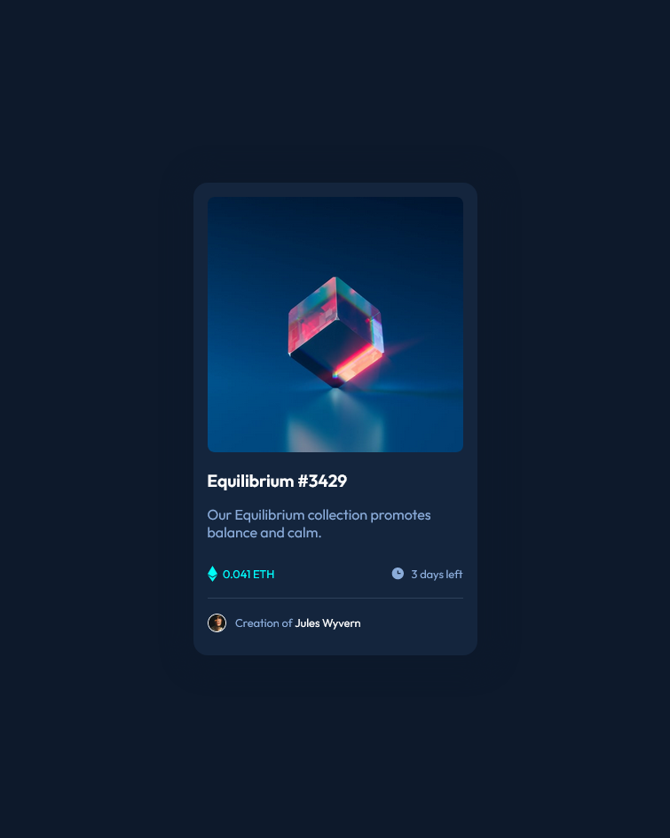

# Frontend Mentor - NFT preview card component solution

This is a solution to the [NFT preview card component challenge on Frontend Mentor](https://www.frontendmentor.io/challenges/nft-preview-card-component-SbdUL_w0U). Frontend Mentor challenges help you improve your coding skills by building realistic projects. 

## Table of contents

- [Overview](#overview)
  - [The challenge](#the-challenge)
  - [Screenshot](#screenshot)
  - [Links](#links)
- [My process](#my-process)
  - [Built with](#built-with)
- [Author](#author)

## Overview

### The challenge

Users should be able to:

- View the optimal layout depending on their device's screen size
- See hover states for interactive elements

### Screenshot

### Links

- Solution URL: [https://github.com/shariful-pradhan-hridoy/NFT-preview-card-component.git](https://github.com/shariful-pradhan-hridoy/NFT-preview-card-component.git)
- Live Site URL: [Add live site URL here](https://your-live-site-url.com)

## My process

### Built with

- Semantic HTML5 markup
- CSS custom properties
- Flexbox
- Mobile-first workflow

## Author

- Website - [Shariful Pradhan Hridoy](https://shariful-pradhan-hridoy.netlify.com/)
- Frontend Mentor - [@shariful-pradhan-hridoy](https://www.frontendmentor.io/profile/shariful-pradhan-hridoy)
- Twitter - [@sharifulhridoy2](https://twitter.com/SharifulHridoy2)
- LinkedIn - [@sharifulhridoy2](https://www.linkedin.com/in/sharifulhridoy2/)
- Whatsapp - [+880 1785-018296](https://wa.me/8801785018296)
- Medium - [@sharifulpradhanhridoy](https://sharifulpradhanhridoy.medium.com/)
